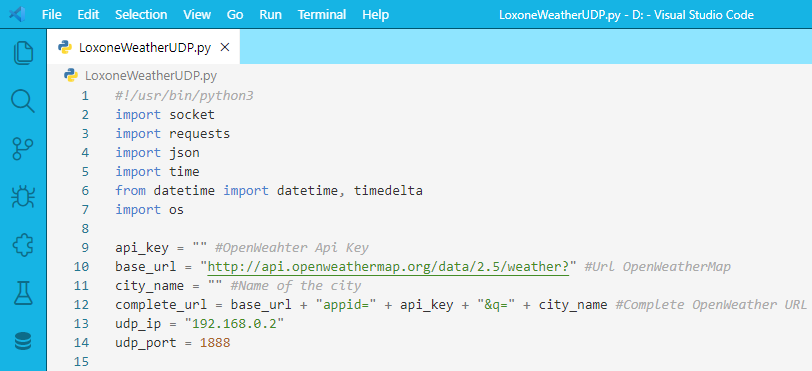

# Ice Dawn
Ice Dawn theme for VS Code. Great mix of white and blue.

   

## Screenshot
Screenshot of a Loxone-Weather-UDP written in Python

If you like this checkout [Ice Dawn](https://marketplace.visualstudio.com/items?itemName=wolfror.ice-dawn)

## Changelog
You can take a look at the change log [here](https://github.com/WolfRorDev/ice-dawn/blob/master/CHANGELOG.md)